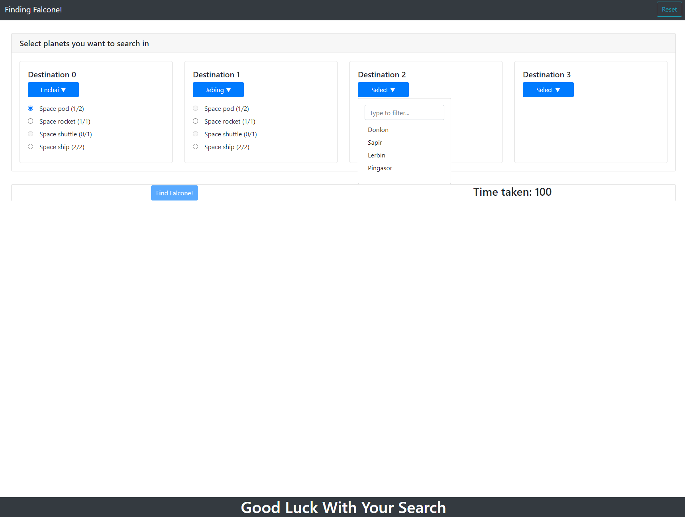

# Finding Falcone!

This project demonstrates how to use Twitter API. Users can search for Twitter using the web form.


The application uses the following technologies:
- Frontend: ReactJs 
- State Management: Redux




## Getting Started


run the client server
```
npm start
```

The server runs on port `3000`.

## Scripts

```
- npm run build            - will run webpact to generate static content out of jsx
- npm test                 - will run all the tests
- npm run eject            - will give access to all config files
- npm start                - will start the dev server
```

## Project Structure


1. The `client/src/App.tsx` directory contains the root react component for the Frontend.
2. The tests are placed next to the related components or modules.

## Development

This project uses tsLint to detect suspicious code in JavaScript files. Visit https://palantir.github.io/tslint/ for details.

### Testing

This project uses jest and React Testing Library for testing.
Visit https://jestjs.io/ and https://testing-library.com/docs/react-testing-library/intro/ for details.

To execute tests:

```bash
npm test
```

To calculate coverage:

```bash
npm run coverage
```

The coverage reports will be in the `coverage` folder

## Future Improvements

1. Improve error handling and CSS styles.
2. More unit tests.

## FAQ

## Credits

Written by Shahriar Hasan Khan
Contact: shahriar27@hotmail.com
